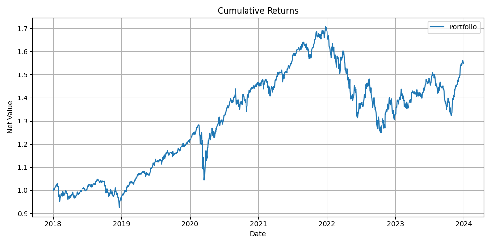

# QF623 ETF Portfolio Management | Project Description

> 📌 Switch language: [🇨🇳 中文说明 (README.zh.md)](./README.zh.md)

---

## 🇬🇧 English Description

This project implements an ETF portfolio strategy that aims to **maximize the Sharpe Ratio** under a **minimum risk constraint**, using historical data from Yahoo Finance.

### 🔍 Objective

- Select ETF universe (exclude leveraged/inverse ETFs)
- Generate **alpha signals** via trend-following
- Optimize portfolio (long-only or long-short) with:
  - Annual volatility ≥ 3%
  - L1 norm of weights ≤ 1
- T+1 portfolio rebalancing logic
- Attribution of performance via factor exposures

### ⚙️ Methodology Summary

- **Universe Filtering:** keyword + volume threshold  
- **Alpha Signal:** MA crossover (20d – 100d)  
- **Optimization:** Sharpe maximization + constraints  
- **Execution:** Simulated T+1 trade  
- **Attribution:** Returns, Sharpe, beta exposures

### 🚀 Quick Start

> 💡 This project uses `pyproject.toml` — we recommend using **`conda`** or **[`uv`](https://github.com/astral-sh/uv)**.

```bash
# If using conda:
conda create -n qf623 python=3.10
conda activate qf623

# If using uv:
pip install uv
uv pip install .
```

```bash
# Run the project
python main.py
# or
uv run main.py
```

### 📈 Output



📄 [Click here to view full performance result → result.md](./result.md)

### 📁 Project Structure

```
├── attribution
│   ├── __pycache__
│   │   └── performance_analysis.cpython-311.pyc
│   └── performance_analysis.py
├── config
│   ├── __pycache__
│   │   └── config_loader.cpython-311.pyc
│   ├── config_loader.py
│   └── config.yaml
├── cumulative_returns.png
├── data
│   ├── __pycache__
│   │   ├── data_loader.cpython-311.pyc
│   │   └── etf_universe.cpython-311.pyc
│   ├── data_loader.py
│   └── etf_universe.py
├── execution
│   ├── __pycache__
│   │   └── rebalance.cpython-311.pyc
│   └── rebalance.py
├── main.py
├── portfolio
│   ├── __pycache__
│   │   └── optimizer.cpython-311.pyc
│   ├── constraints.py
│   └── optimizer.py
├── project_code_dump.txt
├── pyproject.toml
├── README.md
├── README.zh.md
├── result.md
├── signals
│   ├── __pycache__
│   │   └── alpha_signal.cpython-311.pyc
│   └── alpha_signal.py
├── utils
│   ├── __pycache__
│   │   ├── metrics.cpython-311.pyc
│   │   └── plot.cpython-311.pyc
│   ├── metrics.py
│   └── plot.py
└── uv.lock
```

---

## 📜 License

MIT License