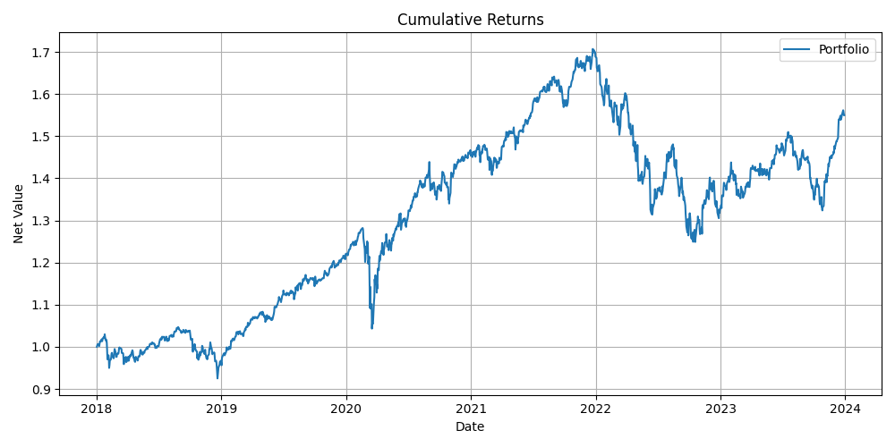

# QF623 ETF 投资组合管理项目 | 项目说明

> 📌 切换语言: [🇬🇧 English Description (README.md)](./README.md)

---

## 🇨🇳 中文说明

本项目实现了一个 ETF 策略，目标是 **在满足最低波动率约束的前提下最大化夏普比率（Sharpe Ratio）**，使用 `yfinance` 获取历史数据，并进行模拟回测与因子归因分析。

### 🎯 项目目标

- 构建 ETF 投资池（排除杠杆/反向产品）
- 通过趋势跟随生成 alpha 信号
- 投资组合构建（支持 long-only / long-short）满足：
  - 年化波动率 ≥ 3%
  - 权重绝对值之和 ≤ 1
- 模拟 T+1 执行逻辑
- 归因分析：收益、beta、对冲等

### ⚙️ 方法摘要

- **ETF 选择**：关键词过滤 + 平均成交量筛选  
- **Alpha 信号**：短期/长期移动平均差值  
- **组合优化**：最大化夏普比率 + 约束条件  
- **T+1 执行模拟**：T 生成信号，T+1 执行，T+2 计收益  
- **表现归因**：输出指标与因子回归结果

### 🚀 快速开始

> 💡 本项目使用 `pyproject.toml` 管理依赖，推荐使用 **`conda`** 或轻量级工具 **[`uv`](https://github.com/astral-sh/uv)**。

```bash
# 使用 conda 创建环境
conda create -n qf623 python=3.10
conda activate qf623

# 使用 uv（可选）
pip install uv  
uv pip install .
```

```bash
# 运行主程序
python main.py
# 或
uv run main.py
```

### 📈 输出示例



📄 [点击此处查看完整的结果→result.md](./result.md)

### 📁 项目结构

```
├── attribution
│   ├── __pycache__
│   │   └── performance_analysis.cpython-311.pyc
│   └── performance_analysis.py
├── config
│   ├── __pycache__
│   │   └── config_loader.cpython-311.pyc
│   ├── config_loader.py
│   └── config.yaml
├── cumulative_returns.png
├── data
│   ├── __pycache__
│   │   ├── data_loader.cpython-311.pyc
│   │   └── etf_universe.cpython-311.pyc
│   ├── data_loader.py
│   └── etf_universe.py
├── execution
│   ├── __pycache__
│   │   └── rebalance.cpython-311.pyc
│   └── rebalance.py
├── main.py
├── portfolio
│   ├── __pycache__
│   │   └── optimizer.cpython-311.pyc
│   ├── constraints.py
│   └── optimizer.py
├── pyproject.toml
├── README.md
├── README.zh.md
├── result.md
├── signals
│   ├── __pycache__
│   │   └── alpha_signal.cpython-311.pyc
│   └── alpha_signal.py
├── utils
│   ├── __pycache__
│   │   ├── metrics.cpython-311.pyc
│   │   └── plot.cpython-311.pyc
│   ├── metrics.py
│   └── plot.py
└── uv.lock
```

---

## 📜 License

MIT License